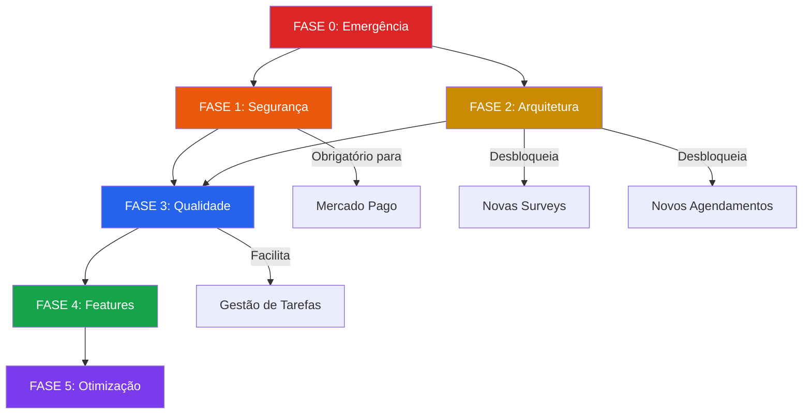

# Evolução BPlen 3.1 — Plano Estratégico de Consolidação e Expansão

> **Versão:** 3.1  
> **Data de Criação:** 16/04/2026  
> **Status:** Em Planejamento  
> **Premissa Central:** Corrigir a fundação → Validar → Expandir com segurança

---

## 1. Diagnóstico Atual

### 1.1 Estado do Codebase (v3.0)

| Métrica | Valor |
|---|---|
| Arquivos fonte | ~170+ |
| Server Actions | 30 arquivos |
| Componentes React | ~60 |
| Testes automatizados | 1 arquivo (45 linhas) |
| Violações `any` | 100+ ocorrências |
| Maior arquivo | `calendar.ts` — 1.441 linhas / 55KB |
| Segundo maior | `survey-effects.ts` — 798 linhas / 35KB |

### 1.2 Features Já Implementadas

- ✅ Sistema de Autenticação (Google OAuth + AuthContext + Middleware)
- ✅ Onboarding (Welcome Survey + Geração de Matrícula)
- ✅ Engine de Surveys (6 pesquisas ativas com cálculo e persistência)
- ✅ Engine de Forms (motor genérico de formulários operacionais)
- ✅ Agenda Google Calendar (sync, booking transacional, quotas)
- ✅ Pós-Evento (wizard admin, presença, atas, planilha consolidação)
- ✅ Jornada de Membro (7 etapas com navegação e progresso)
- ✅ Dashboard de Resultados (Tríade, VACD, Reconhecimento, DISC)
- ✅ Painel Admin (gestão de usuários, permissões, assessments)
- ✅ Social Hub (feed de conteúdo, avaliações, Drive sync)
- ✅ Sistema de Temas (7 modos visuais + acessibilidade)
- ✅ Checkout básico (estrutura de produtos, cupons)
- ✅ Espelhamento Google Drive/Sheets (automático por survey)
- ✅ Upload de Foto de Perfil (crop, Drive, thumbnail)
- ✅ Guided Tour (onboarding interativo)
- ✅ Sistema de Entitlements (permissões granulares por serviço)
- ✅ Networking (listagem de membros)

### 1.3 Features Pendentes (Roadmap de Expansão)

| # | Feature | Tipo | Complexidade Estimada |
|---|---|---|---|
| F1 | ~10 novas Surveys/Forms | Survey/Form Engine | 🟡 Média (por unidade) |
| F2 | ~10 lógicas de agendamento | Calendar Actions | 🟡 Média |
| F3 | ~10 lógicas de avaliação de conteúdo | Content + Admin | 🟡 Média |
| F4 | Disponibilização de atas para membros | Member Area | 🟢 Baixa |
| F5 | Checkout via Mercado Pago | Payment Integration | 🔴 Alta |
| F6 | Gestão de tarefas por usuário | Novo módulo completo | 🔴 Alta |

### 1.4 Criticidades da Auditoria (Resumo)

| ID | Criticidade | Severidade |
|---|---|---|
| C1 | Cookie de sessão inseguro (UID plaintext) | 🔴 Crítica |
| C2 | Log parcial da chave PEM em produção | 🔴 Crítica |
| C3 | Zero headers de segurança HTTP | 🔴 Alta |
| C4 | Cobertura de testes ~0% | 🟠 Alta |
| C5 | 100+ violações da Política Zero-Any | 🟠 Alta |
| C6 | God Files monolíticos (calendar + survey-effects) | 🟠 Média-Alta |
| C7 | AuthProvider bloqueia páginas públicas | 🟡 Média |
| C8 | Imagens sem otimização (next/image) | 🟡 Média |
| C9 | Sem Error Boundaries | 🟡 Média |
| C10 | Sem rate limiting | 🟡 Média |

---

## 2. Estratégia de Evolução

### Princípios

1. **Não parar o negócio.** Correções devem ser incrementais e validáveis.
2. **Cada fase tem entrega verificável.** Só avança quando a fase anterior passa no `npm run check` + testes manuais.
3. **Correção estrutural desbloqueia features.** As refatorações são escolhidas por facilitar o que vem depois.
4. **Prioridade: segurança → estabilidade → performance → features.**

### Cronograma Visual

```
FASE 0 ──▸ FASE 1 ──▸ FASE 2 ──▸ FASE 3 ──▸ FASE 4 ──▸ FASE 5
Urgente    Fundação    Arquitetura  Qualidade   Features    Otimização
(1 dia)    (2-3 dias)  (3-4 dias)   (2-3 dias)  (contínuo)  (contínuo)
```

---

## 3. Plano de Execução por Fases

---

### FASE 0 — Ações de Emergência ⚡
**Prazo:** 1 dia  
**Objetivo:** Eliminar vulnerabilidades críticas imediatas  
**Risco de implementação:** 🟢 Zero

#### Tarefas

- [ ] **C2** — Remover log da PEM em `env.ts` (linha 43-45)
  - Ação: Substituir por `console.log(\`[PEM] Key loaded: ${cleaned.length} chars\`)`
  - Validação: `npm run build` + verificar logs em Vercel

- [ ] **C9** — Criar `error.tsx` em `/hub` e `/admin`
  - Ação: Arquivo com fallback visual BPlen (mensagem + botão "voltar")
  - Validação: Forçar erro artificial e verificar que a app não fica branca

- [ ] **C5 (preventivo)** — Ativar regra ESLint `@typescript-eslint/no-explicit-any` como `error`
  - Ação: Adicionar rule no `eslint.config.mjs`
  - Nota: Usar `// eslint-disable-next-line` nos ~100 existentes por enquanto
  - Validação: `npm run lint` passa; novos `any` são bloqueados

#### Critério de Aprovação
```powershell
npm run check  # lint + test + type-check + build — tudo verde
```

---

### FASE 1 — Fundação de Segurança 🔐
**Prazo:** 2-3 dias  
**Objetivo:** Tornar a autenticação criptograficamente segura  
**Risco de implementação:** 🟡 Médio (afeta fluxo de login)

#### Tarefas

- [ ] **C1** — Migrar para Firebase Session Cookies assinados
  - Ação:
    1. No login (`use-auth.ts`): obter `idToken` via `user.getIdToken()`
    2. Criar Server Action `createSessionCookie(idToken)` usando `admin.auth().createSessionCookie()`
    3. Alterar `syncSessionCookie` para gravar o session cookie assinado
    4. Alterar `getServerSession` para usar `admin.auth().verifySessionCookie()`
    5. Alterar `middleware.ts` para validar via cookie assinado (ou apenas checar existência, delegando validação profunda ao layout)
  - Validação:
    - [ ] Login: funciona normalmente
    - [ ] Logout: cookie é removido
    - [ ] Cookie forjado: acesso negado (testar com valor aleatório no DevTools)
    - [ ] Admin: acesso mantido para contas master
    - [ ] Expiração: sessão expira após período configurado

- [ ] **C3** — Configurar Security Headers no `next.config.ts`
  - Headers obrigatórios:
    - `X-Frame-Options: DENY`
    - `X-Content-Type-Options: nosniff`
    - `Strict-Transport-Security: max-age=31536000; includeSubDomains`
    - `Referrer-Policy: strict-origin-when-cross-origin`
    - `Permissions-Policy: camera=(), microphone=(), geolocation=()`
  - Validação: Verificar headers no DevTools → Network → Response Headers

- [ ] **C10 (básico)** — Rate limiting por UID em ações críticas
  - Ação: Criar `lib/rate-limit.ts` com timestamp check no Firestore
  - Aplicar em: `bookEventAction`, `submitSurvey`, `checkout`
  - Regra: Máximo 1 chamada a cada 5 segundos por UID por ação
  - Validação: Clicar rápido no botão de booking, verificar que a segunda chamada é bloqueada

#### Critério de Aprovação
```powershell
npm run check  # Build limpo
# + Testes manuais: login, logout, cookie forjado, headers, rate limit
```

---

### FASE 2 — Refatoração Arquitetural 🏗️
**Prazo:** 3-4 dias  
**Objetivo:** Decompor God Files e criar padrões reutilizáveis  
**Risco de implementação:** 🟡 Médio (mover código entre arquivos)

> **Esta é a fase que DESBLOQUEIA a implementação das 40+ features pendentes.**

#### Tarefas

- [ ] **C6-C** — Extrair `lib/drive-sync.ts` (helper genérico)
  - Ação: Criar função unificada que aceita config:
    ```typescript
    interface DriveSyncConfig {
      matricula: string;
      surveyName: string;
      headers: string[];
      rowData: (string | number | boolean | null)[];
    }
    async function syncSurveyToDrive(config: DriveSyncConfig): Promise<void>
    ```
  - Migrar as 6 implementações duplicadas em `survey-effects.ts` para usar este helper
  - Validação: Executar uma survey existente (ex: `gestao_tempo`) e verificar que o Drive continua funcionando

- [ ] **C6-B** — Extrair `lib/email-templates/`
  - Ação:
    1. Criar `lib/email-templates/booking-confirmation.ts`
    2. Criar `lib/email-templates/admin-inclusion.ts`
    3. Cada template é uma função pura: `(data) => string` (retorna HTML)
  - Migrar os 2 templates inline do `calendar.ts` para usar os novos
  - Validação: Fazer um booking e verificar que o email chega formatado corretamente

- [ ] **C6-A** — Decompor `survey-effects.ts` em módulos
  - Ação: Criar pasta `actions/effects/` com 1 arquivo por survey:
    ```
    actions/effects/welcome.ts
    actions/effects/check-in.ts
    actions/effects/gestao-tempo.ts
    actions/effects/preferencias-aprendizado.ts
    actions/effects/preferencias-reconhecimento.ts
    actions/effects/pre-analise-comportamental.ts
    actions/effects/desmistificando-candidaturas.ts
    actions/effects/revisao-curriculo.ts
    actions/effects/index.ts  (dispatcher que importa todos os acima)
    ```
  - O `handleSurveySideEffects` no `index.ts` vira um switch/map que delega para o módulo correto
  - Validação: Executar **cada** survey existente e verificar persistência Firestore + Drive

- [ ] **C6-A** — Decompor `calendar.ts` em módulos
  - Ação:
    ```
    actions/calendar/queries.ts       (fetchCalendarEvents, getEventAttendees)
    actions/calendar/booking.ts       (bookEventAction, adminAddAttendeeAction)
    actions/calendar/sync.ts          (syncCalendarToFirestore, updateGlobalRegistry)
    actions/calendar/sheets.ts        (generateEventSummarySheetAction)
    actions/calendar/post-event.ts    (post-event wizard actions)
    actions/calendar/index.ts         (re-exports)
    ```
  - Validação: Fazer um booking completo e verificar todo o fluxo (inscrição → email → sheets)

- [ ] **C7** — Desbloquear renderização de páginas públicas
  - Ação: 
    1. Remover `{!loading && children}` do `AuthContext.tsx` → trocar por `{children}`
    2. Mover o loading gate para o `HubShell.tsx` (que já tem o spinner)
    3. Garantir que páginas públicas (Home, Serviços, Agendamento) não usam `useAuthContext`
  - Validação:
    - [ ] Home pública carrega instantaneamente (sem spinner)
    - [ ] Hub continua com proteção de loading
    - [ ] Login/logout funcionam normalmente

#### Critério de Aprovação
```powershell
npm run check  # Build limpo
# + Testar cada survey existente (6 surveys)
# + Testar booking completo (inscrição + email + sheets)
# + Testar home pública (carregamento instantâneo)
# + Testar admin (acesso + gestão)
```

---

### FASE 3 — Qualidade e Cobertura 🧪
**Prazo:** 2-3 dias  
**Objetivo:** Criar rede de segurança para as features futuras  
**Risco de implementação:** 🟢 Baixo (apenas adiciona, não modifica)

#### Tarefas

- [ ] **C4-A** — Testes de integração para fluxos críticos
  - Criar com mocks do Admin SDK:
    - [ ] `__tests__/actions/resolve-identity.test.ts` — todos os fallbacks de matrícula
    - [ ] `__tests__/actions/auth-guards.test.ts` — requireAdmin, requireAuth, requireMemberAccess
    - [ ] `__tests__/actions/booking.test.ts` — regras de governança (semana, capacidade, quota)
    - [ ] `__tests__/actions/drive-sync.test.ts` — helper genérico de Drive sync
  - Validação: `npm run test` — 100% passando

- [ ] **C5-A** — Eliminação de `any` nas Server Actions (prioridade: dinheiro e identidade)
  - Ordem de prioridade:
    1. `actions/checkout.ts` — envolve pagamento
    2. `actions/auth-permissions.ts` — controla acesso
    3. `actions/calendar/booking.ts` — transações de quota
    4. `actions/effects/*.ts` — dados de survey
    5. Demais actions
  - Validação: `npm run type-check` sem erros + `npm run lint` sem warnings de `any`

- [ ] **C8-A** — Configurar `next/image` com remotePatterns
  - Ação:
    1. Adicionar `images.remotePatterns` no `next.config.ts` para domínios Google
    2. Migrar avatar no `HubHeader.tsx` de `` para `<Image>`
    3. Migrar ícones sociais (linkedin, insta, whatsapp, tiktok)
  - Validação: Imagens carregam em WebP/AVIF no DevTools

#### Critério de Aprovação
```powershell
npm run check  # lint + test (agora com 4+ suites) + type-check + build
```

---

### FASE 4 — Retomada de Features 🚀
**Prazo:** Contínuo  
**Objetivo:** Implementar as features pendentes sobre a base consolidada

> A partir daqui, cada feature nasce nos padrões corretos:
> - Surveys → 1 arquivo em `actions/effects/{id}.ts` + usa `drive-sync.ts` genérico
> - Bookings → módulo isolado em `actions/calendar/`
> - Templates de email → reutilizáveis de `lib/email-templates/`
> - Tipagem → sem `any`, ESLint bloqueia
> - Testes → cada novo módulo ganha ao menos 1 test suite

#### Onda 4.1 — Surveys & Forms (prioridade: jornada do membro)
- [ ] Implementar ~10 novas surveys/forms conforme workflows `criar-survey` e `criar-form`
- [ ] Cada nova survey: config + effect + drive sync — 3 arquivos, ~60 linhas total
- [ ] Testar cada survey individualmente antes de ir para a próxima

#### Onda 4.2 — Agendamentos & Conteúdo
- [ ] Implementar ~10 lógicas de agendamento (novas modalidades de evento)
- [ ] Implementar ~10 lógicas de avaliação de conteúdo
- [ ] Disponibilização de atas para membros (leitura de Drive via entitlements)

#### Onda 4.3 — Checkout Mercado Pago 💳
- [ ] Integração com API de Preferências do Mercado Pago
- [ ] Webhook de notificação de pagamento (API Route)
- [ ] Fluxo: carrinho → checkout → pagamento → entitlement automático
- [ ] Pré-requisito obrigatório: **FASE 1 concluída** (sessão segura)

#### Onda 4.4 — Gestão de Tarefas por Usuário 📋
- [ ] Modelagem Firestore: `User/{mat}/User_Tasks/{taskId}`
- [ ] CRUD de tarefas (criar, listar, atualizar status, arquivar)
- [ ] Painel admin: atribuir tarefas a membros
- [ ] Painel membro: ver tarefas, marcar conclusão
- [ ] Notificação por email (novo template)

---

### FASE 5 — Otimização Contínua 🔧
**Prazo:** Ongoing  
**Objetivo:** Performance e polish

- [ ] Lazy loading de componentes pesados (`MemberDashboardView`, `SurveyEngine`)
- [ ] Migrar mais pages de `"use client"` para Server Components onde possível
- [ ] Reduzir uso de `backdrop-blur` em telas com muitos elementos simultâneos
- [ ] Considerar `React.lazy()` para `framer-motion` em componentes não-críticos
- [ ] Implementar Sentry/LogRocket para monitoramento de erros em produção
- [ ] Auditoria de acessibilidade WCAG AA (contraste, aria-labels, keyboard nav)
- [ ] Testes E2E com Playwright para cenários críticos

---

## 4. Regras de Transição entre Fases

| Regra | Detalhe |
|---|---|
| **Gate obrigatório** | `npm run check` deve passar 100% antes de avançar de fase |
| **Testes manuais** | Cada fase lista seus cenários obrigatórios de validação |
| **Rollback** | Se uma fase quebrar algo, reverter via git antes de continuar |
| **Sem paralelismo de fases** | Não iniciar Fase N+1 sem concluir Fase N (exceto Fase 0 que é imediata) |
| **Features isoladas (Fase 4)** | Na Fase 4, cada onda pode rodar em paralelo entre si |
| **Deploy incremental** | Cada fase concluída = 1 deploy para produção |

---

## 5. Mapa de Dependências



---

## 6. Estimativa de Esforço Total

| Fase | Prazo | Foco |
|---|---|---|
| **Fase 0** | 1 dia | Emergência (PEM, Error Boundary, ESLint) |
| **Fase 1** | 2-3 dias | Segurança (Session Cookie, Headers, Rate Limit) |
| **Fase 2** | 3-4 dias | Arquitetura (Decomposição, Drive Sync, Auth Fix) |
| **Fase 3** | 2-3 dias | Qualidade (Testes, Zero-Any, next/image) |
| **Subtotal Consolidação** | **8-11 dias** | **Base pronta para expansão segura** |
| **Fase 4** | Contínuo | Features (Surveys, Bookings, Checkout, Tasks) |
| **Fase 5** | Contínuo | Otimização (Performance, Monitoring, PWA) |

---

> **Visão Final:** Ao concluir as Fases 0-3, o BPlen HUB terá uma fundação segura, testada e modular — onde cada nova feature é um módulo isolado de ~60 linhas que se conecta a padrões reutilizáveis. O projeto estará preparado para escalar para 300+ arquivos com confiança.

---

*BPlen HUB — Excelência em Desenvolvimento Humano.*
